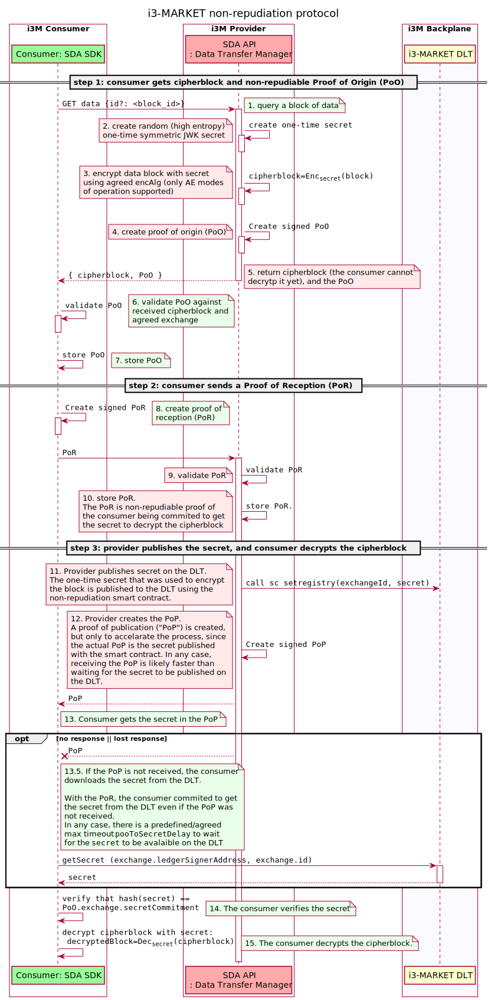
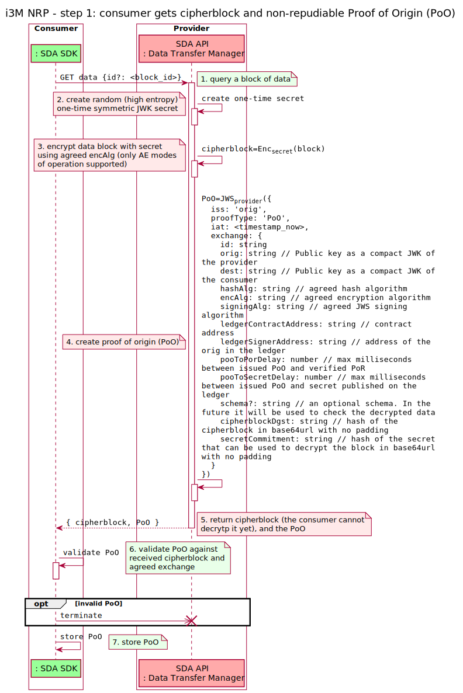
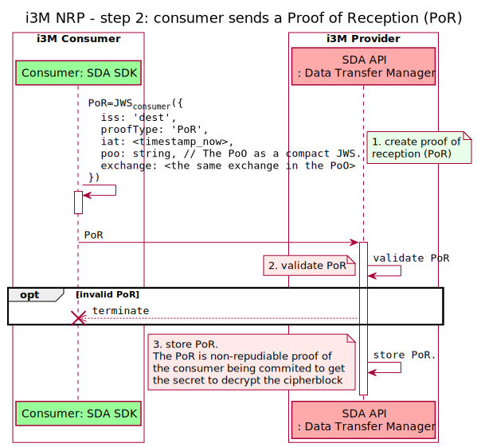
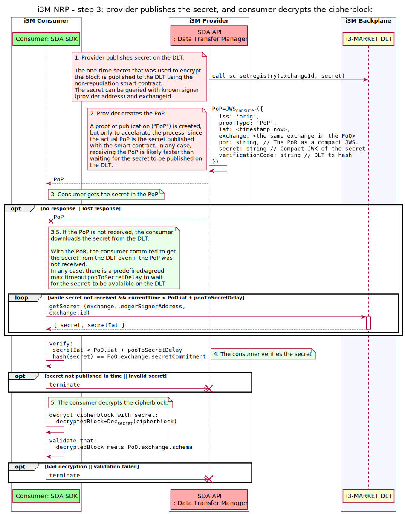
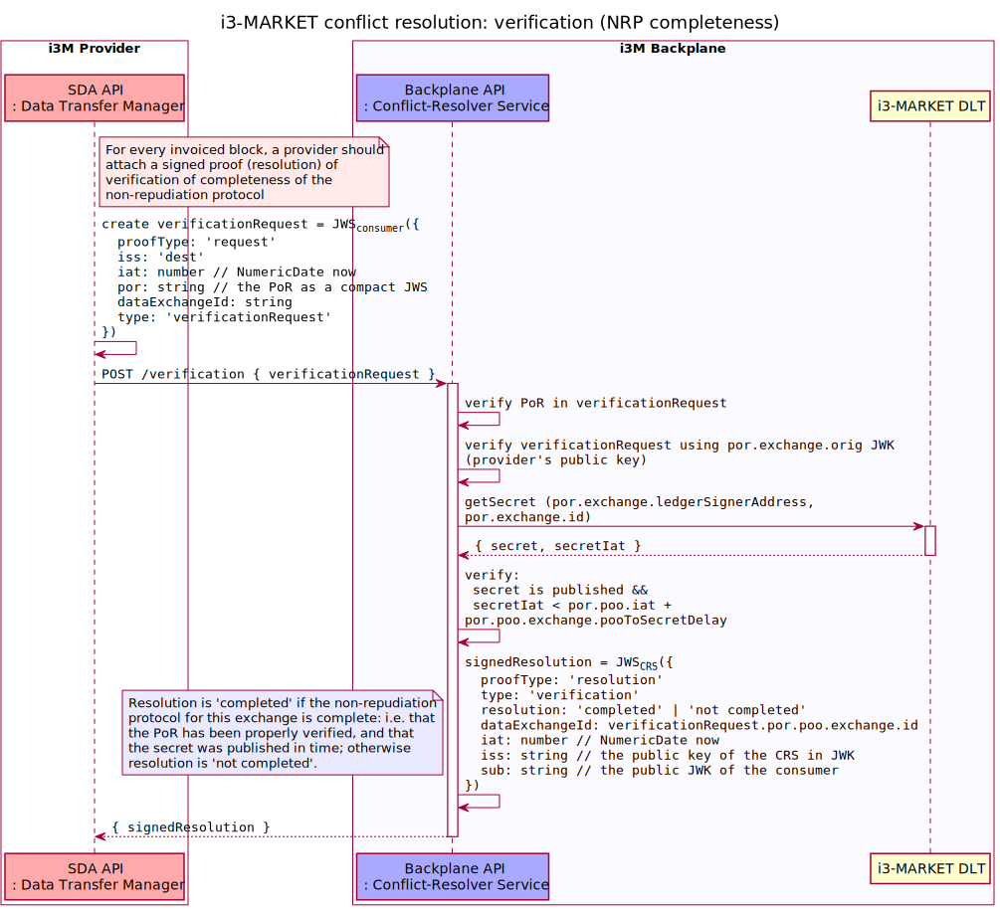
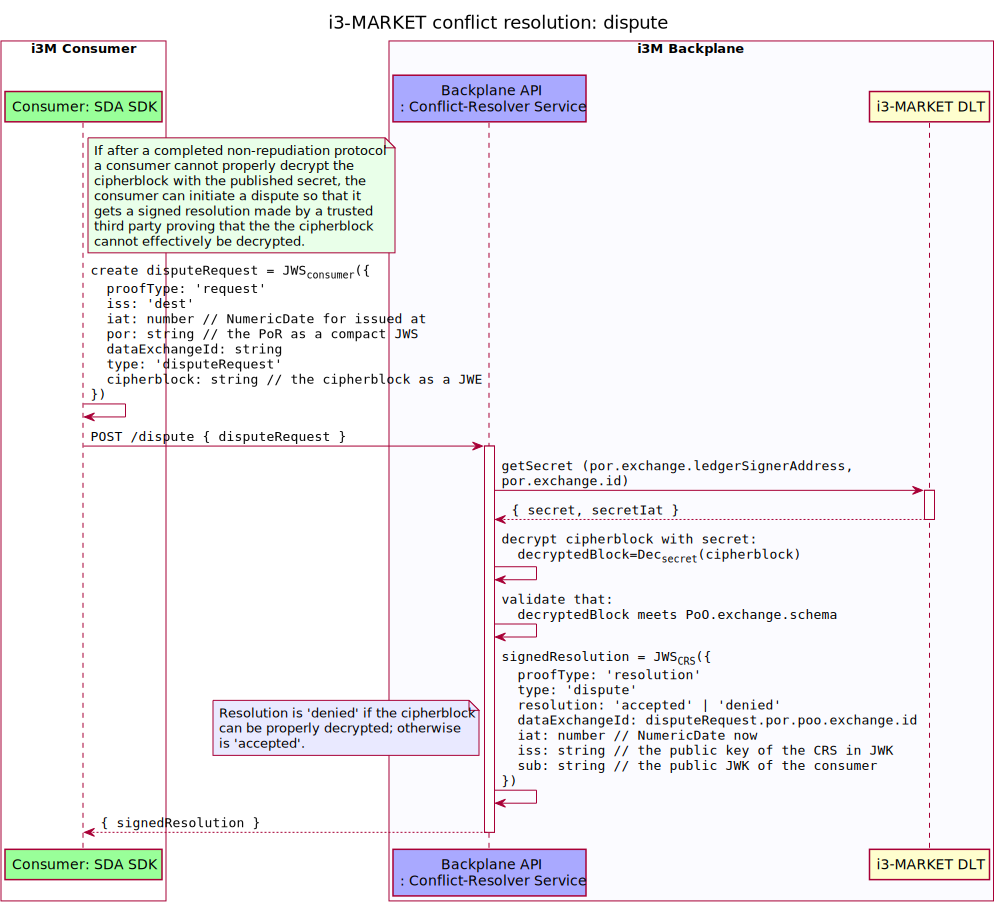

# Conflict Resolution / Non-repudiation protocol

The conflict resolution system main goal is to prevent and or solve conflicts when invoicing for a given exchange of data.

For the Conflict Resolution system to work, the i3-MARKET Non-Repudiation Protocol (NRP) must be executed with every exchanged block of data. If the NRP is followed, any third party could verify the actual data exchange in order to prevent and/or solve a dispute. The Conflict-Resolver Service (CRS) can be run by a trusted third party to issue verifiable signed resolutions regarding the execution of the NRP.

As per the above explanation, the Conflict Resolution system relies on two subsystems:

 1. [The non-repudiation-protocol library](https://github.com/i3-Market-V2-Public-Repository/SP3-SCGBSSW-CR-NonRepudiationLibrary); and
 2. [The conflict-resolver service](https://github.com/i3-Market-V2-Public-Repository/SP3-SCGBSSW-CR-ConflictResolverService).

- [1. Use cases](#1-use-cases)
- [2. The non-repudiation protocol](#2-the-non-repudiation-protocol)
  - [2.1. Detailed diagrams](#21-detailed-diagrams)
    - [NRP - step 1: consumer gets cipherblock and non-repudiable Proof of Origin (PoO)](#nrp---step-1-consumer-gets-cipherblock-and-non-repudiable-proof-of-origin-poo)
    - [NRP - step 2: consumer sends a Proof of Reception (PoR)](#nrp---step-2-consumer-sends-a-proof-of-reception-por)
    - [NRP - step 3: provider publishes the secret, and consumer decrypts the cipherblock](#nrp---step-3-provider-publishes-the-secret-and-consumer-decrypts-the-cipherblock)
    - [Conflict resolution: verification (NRP completeness)](#conflict-resolution-verification-nrp-completeness)
    - [Conflict resolution: dispute](#conflict-resolution-dispute)

## 1. Use cases

The Conflict Resolution will prevent the following situations any two peers of a data exchange, namely provider and consumer:

- to deny that a given data-block exchange happened,
- or to assert that a data-block exchange that did not happen, happened

As a result, providers will not be able to invoice a consumer for a data block not exchanged; and consumers will not be able to deny or cancel a payment for a data block that was successfully exchanged.

For it to happen, every block of data must exchanged using the non-repudiation protocol. Accounted proofs give no room to alter the invoicing (fiat money) or the crypto payments (i3-MARKET tokens) if both entities reliably execute the protocol; otherwise the Conflict Resolver service can be invoked to univocally solve which entity is intentionally or unintentionally malfunctioning.

## 2. The non-repudiation protocol

The non repudiation protocol starts with a Provider Alice, hereby A, sending a signed Proof of Origin (PoO) along with an encrypted block of data to a Consumer Bob, hereby B.

An overview of the protocol is depicted in the next figure, and more detailed sequence diagrams of every step are provided in section [2.1. Detailed diagrams](#21-detailed-diagrams).

After validating the PoO, B will demonstrate his will to get the data by sending a signed Proof of Reception (PoR). Just recall that B is at this point not yet able to decrypt the data, since he does not know the secret to decrypt them.

The PoR is a proof that can be used by A to demonstrate that B is committed to get the secret to decrypt the block of data.

Now A can release the secret as part of a Proof of Publication (PoP). However, as B may state that he did not receive the PoP, A also publishes the secret to the ledger. It is now under B's responsibility to get the secret from the ledger, since he implicitly agreed to it when sending the PoR.

For A to create a valid invoice for that block of data, she MUST present a valid PoR and demonstrate that the secret was published to the ledger within the agreed delay (part of the agreement). As a result, the lack of one or both proofs will result in an invalid invoice.

The Conflict-Resolver Service (CRS) can be queried to provide a signed resolution about the non-repudiation protocol associated to an invoice being valid or invalid. It could be invoked by either the consumer or the provider. The latter should be mandatory, being the resolution sent along with the invoice to the consumer.

However, this resolution does not ensure that the published secret could be used to decrypt the encrypted block of data. If the consumer B is not able to decrypt the cipherblock, he could initiate a dispute on the CRS. The CRS will also provide signed resolution of whether B is right or not.

### 2.1. Detailed diagrams

#### NRP - step 1: consumer gets cipherblock and non-repudiable Proof of Origin (PoO)

#### NRP - step 2: consumer sends a Proof of Reception (PoR)

#### NRP - step 3: provider publishes the secret, and consumer decrypts the cipherblock

#### Conflict resolution: verification (NRP completeness)

#### Conflict resolution: dispute

